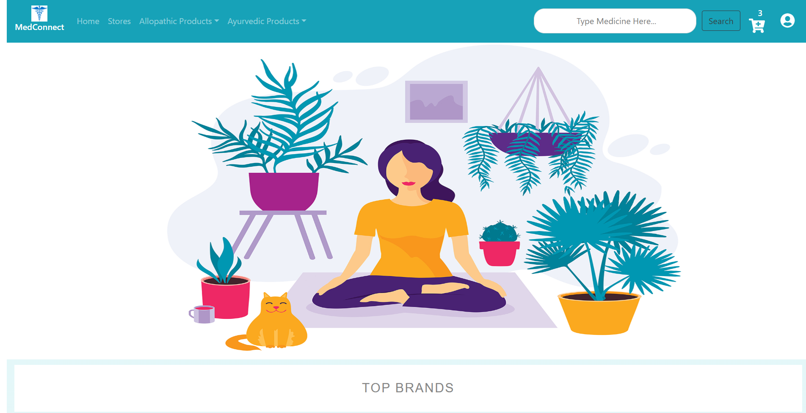

# MedConnect Web

A noble way of showing up medicines at community level which supports both generic and branded in both allopathic and ayurvedic medicines and making searches and recommendations easier from home.

Visit here - [https://tapish2000.github.io/medconnect-web](https://tapish2000.github.io/medconnect-web)   
Link to App - [https://github.com/shobhi1310/MedConnect](https://github.com/shobhi1310/MedConnect)

## Features (R-1)
 - 2 broad categories of medicines - allopathic and ayurvedic
 - Each category has been brokendown further into branded and generic
 - Tag based searching for multiple medicines.
 - Cart system present.
 - Map view of stores present.
## Screenshots

## What's Special!!
- 2 broad categories of medicines - Allopathic and Ayurvedic
- Each category has been broken down further into Branded and Generic
- Tag based searching for multiple medicines.
- Cart system present.
- Map view of stores present
- Show brands and Daily use product
- Current Bookings and past History for customer
- Show Details of medicines

## Steps to run the application
- Visit the site at this [link](https://tapish2000.github.io/medconnect-web/#/)
- In the top right corner, click on the user’s icon and select login if first time logging-in
- For testing purposes use credentials
   - Username: `tapishojha2000@gmail.com`
   - Password: `taps123`
- For searching medicines, enter medicine names for example Wikoryl, Propygenta in the search bar and select the tags generated and click the Search button
- For booking any medicine from those click on the book medicine button
- For exploring Ayurvedic and Allopathic products use the nav links

## Future Release
- Ayurvedic alternatives to be recommended for any allopathic medicines searched
- Medicine Booking functionality for customer
- Medicine Search functionality in a particular Shop
- Shop inventory management from shopkeeper’s end
- Community forum and dashboards for posting daily news feed related to health
- Security vulnerability will be removed in terms of password encryption, cookie storage, etc.

## Request Changes
 1. Create an appropriate issue
 2. Issue should have
    - Description
    - Steps to reproducs error (in-case any bug)
    - Idea (in-case of any enhancement or new feature)
## Installation
 1. Fork and clone the repo.
 2. Run `git clone <your_forked_repo>`
 3. Run `cd medconnect-web`
 4. Run `npm install`
 5. Run `npm start`
 6. Go to `localhost:3000` at your browser
## Contribution
 1. Fetch upstream and make your master same as that of acctual repsoitory master
 2. Run `git checkout -b <branch_name>`
 3. Make appropriate changes and commit them using `git add .` and `git commit`
 4. Push it to your branch and make a Pull Request.
